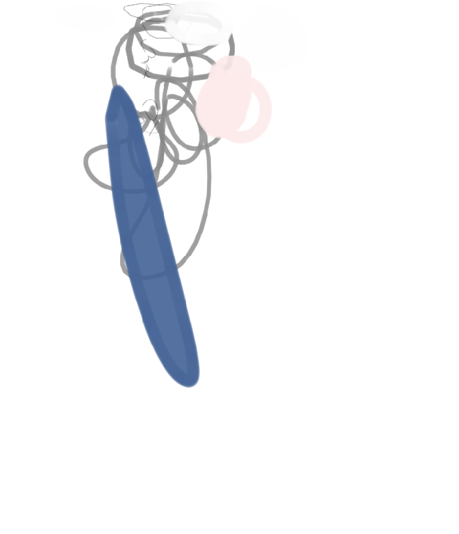

# Krita Canvas MCP

将 Krita 封装为 MCP（Model Context Protocol）工具集 + 闭环绘画 Agent：LLM 基于目标图像和画布快照逐笔预测动作，调用 Krita LibKis API 执行，迭代完成对目标图像的过程重建。

```
┌──────────────┐  MCP tools    ┌──────────────────┐  JSON-RPC HTTP  ┌─────────────┐
│  MCP 客户端   │ ←──────────→ │ external MCP     │ ←─────────────→ │ Krita 插件   │
│ (Claude等)    │  (stdio/http) │ server (src/)    │  127.0.0.1:5678 │ (plugin/)    │
└──────────────┘               └────────┬─────────┘                 └─────────────┘
                                        │ 直接 bridge.call()
                                        ▼
                               ┌──────────────────┐  ┌────────────────────┐
                               │ 闭环 Agent (loop) │→→│ 任意 OpenAI 兼容 VLM │
                               │ target+快照+热力图 │  │ (glm-4.6v/agnes…)  │
                               └──────────────────┘  └────────────────────┘
```

- **`plugin/`**：Krita 内插件（LibKis 必须在主线程执行；HTTP 请求经队列由 QTimer 消费）
- **`src/krita_canvas_mcp/`**：MCP 服务器（无状态工具转发）+ `agent/` 闭环绘画代理（有状态：阶段/计划/颜色账本/动作历史/停滞检测）
- **`scripts/`**：插件安装、全量工具测试脚本
- **`tests/fixtures/`**：测试用目标图

## 快速开始

### 1. 部署 Krita 插件

```bash
# 复制到 Krita 的 pykrita 目录（Windows: %APPDATA%\krita\pykrita）
python scripts/install_plugin.py

# 开发模式（软链，修改 plugin/ 即时生效）
python scripts/install_plugin.py --link
```

重启 Krita → 设置 → 配置 Krita → Python 插件管理器 → 勾选 `Krita Canvas MCP` → 再重启。

控制台出现 `[krita-canvas-mcp] HTTP RPC listening on 127.0.0.1:5678` 即成功。

### 2. 配置 VLM（闭环 Agent 必需）

在项目根目录创建 `.env` 文件：

```
VLM_BASE_URL=https://open.bigmodel.cn/api/paas/v4
VLM_API_KEY=your-api-key-here
VLM_MODEL=glm-4.6v-flash
```

支持的环境变量覆盖：`VLM_BASE_URL`、`VLM_API_KEY`（兼容 `GLM_API_KEY`）、`VLM_MODEL`。

### 3. 新建画布

在 Krita 中按目标图尺寸新建文档（推荐 RGBA/U8，白底填充可选）。Agent 也支持自动创建（见下方 CLI 选项）。

### 4. 跑闭环 Agent

```bash
python -m krita_canvas_mcp.agent --target <目标图路径> [--max-iterations 200]
```

可选参数：

| 参数 | 说明 | 默认值 |
|---|---|---|
| `--max-iterations` | 最大迭代次数 | 200 |
| `--api-key` | VLM API Key（优先于 .env） | 从 .env 读取 |
| `--model` | 模型名（优先于 .env） | 从 .env 读取 |
| `--base-url` | OpenAI 兼容接口根地址（优先于 .env） | 从 .env 读取 |
| `--retries` | VLM 失败重试次数；`0`=不重试；`None`=无限 | 无限 |
| `--raw-output` | 打印 AI 原始输出文本（调试用） | — |
| `--confirm` | 每步执行前暂停等待用户确认（回车继续 / q 退出） | — |
| `--enable-thinking` | 启用思考模式（Agnes 模型专用，提升推理能力） | — |
| `--out-dir` | 结果输出目录 | `outputs/` |
| `--endpoint` | Krita 插件 RPC 地址 | `http://127.0.0.1:5678/rpc` |

结果落盘 `outputs/`：
- `final_*.png` — 最终画布截图
- `summary_*.json` — 会话指标、阶段分布、终止原因
- `action_history.jsonl` — 逐轮动作记录

### 5. 仅用 MCP 工具（不跑闭环 Agent）

```bash
# stdio 模式（Claude Desktop、Cursor 等 AI 编辑器接入）
python -m krita_canvas_mcp

# Streamable HTTP 模式（供 curl 调试）
python -m krita_canvas_mcp --transport streamable-http --port 8765
```

## 闭环契约

- **四阶段** `A 草图 → B 线稿 → C 填色 → D 光影`，显式 `next_stage` 切换（服务端校验：顺序推进 + 本阶段最少成功动作数，不满足拒绝并回显原因让模型重试）
- **每轮一个动作**：`{"thought":"≤60字三段式","stage":"C","tool":"paint_path","params":{...},"color":"c3"}`
- **硬约束** 按阶段锁翻车：
  - A：禁止填充；笔刷 4~12px；仅允许灰/蓝色
  - B：禁止填充；笔刷 ≤3px；仅允许灰/蓝色
  - C：禁止半透明叠色（opacity < 0.9）
  - D：建议实色（opacity ≥ 0.9）
- **上下文装配** 每轮全量给：目标图 + 画布快照 + 热力图（C/D 阶段）+ 会话状态 + 颜色账本（c1..cN）+ 近 5 步动作 + 区域进度
- **三重终止** LLM 自报 `done` / 达到迭代上限 / 像素收敛（ΔE<4 且 SSIM>0.92），附加停滞检测：连续 3 轮无改善注入提示、5 轮强制终止
- LLM 的 `color` 字段支持 `cN`（账本编号，按使用频率降序）或 `#RRGGBB`，执行前自动转为 `set_colors(foreground)`

## 工具清单（59 个）

所有工具定义见 `src/krita_canvas_mcp/resources/mcp-tools-schema.json`。

### 观测（observe.py）

| 工具 | 说明 |
|---|---|
| `get_document_info` | 获取当前文档元信息（尺寸、色彩模型、色深、配置文件、分辨率、是否已修改） |
| `get_canvas_snapshot` | 拍摄画布合成结果快照（PNG base64 + 哈希） |
| `get_node_pixels` | 读取单个图层内容（非合成，PNG base64） |
| `list_channels` | 列出图层全部颜色/Alpha 通道（名称/可见性/位宽/边界） |
| `get_channel_pixels` | 读取单通道灰度图（PNG base64） |
| `get_selection_pixels` | 当前选区输出为灰度蒙版 PNG（0~255 selectedness） |
| `get_view_state` | 读回视图状态（缩放/旋转/镜像）与当前绘画参数 |
| `list_documents` | 枚举 Krita 打开的所有文档 |

### 绘画（paint.py）

| 工具 | 说明 |
|---|---|
| `paint_line` | 两点直线（带首尾压感），适合轮廓/排线 |
| `paint_path` | 沿折线/贝塞尔路径绘制自由笔画（闭环主通道） |
| `paint_shape` | 椭圆/矩形/多边形色块（可选描边+填充） |
| `write_pixels` | 将像素补丁（RGBA PNG/base64）直接写入图层指定区域 |
| `check_paintability` | 检查图层能否被当前笔刷绘制（PAINT/VECTOR/CLONE/UNPAINTABLE） |
| `wait_for_done` | 阻塞至所有后台笔刷任务完成并刷新投影合成 |

### 笔刷/颜色（brush.py）

| 工具 | 说明 |
|---|---|
| `set_colors` | 设置前景/背景色（`#RRGGBB` 或 `[r,g,b(,a)]`） |
| `set_brush_params` | 批量设置画笔参数：size/opacity/flow/rotation/pattern_size |
| `set_brush_preset` | 按名称激活笔刷预设 |
| `list_resources` | 枚举可用资源：preset/brush/pattern/gradient/palette/workspace |
| `set_blending_mode` | 设置画笔混合模式（view 级）或图层混合模式（node 级） |
| `set_brush_flags` | 橡皮模式/锁定透明像素/禁用压感开关 |
| `sample_color` | 从目标图/画布/图层采样颜色，返回多种色彩空间表示（srgb_hex/srgb_255/lab/hsv） |
| `undo` | 撤销上一步（支持多步） |
| `redo` | 重做被撤销的操作 |

### 图层/节点（node.py）

| 工具 | 说明 |
|---|---|
| `get_node_tree` | 获取图层树（名称/类型/id/可见性/透明度/混合模式/父子关系） |
| `create_node` | 创建图层/蒙版并挂到指定父节点 |
| `create_fill_layer` | 创建整层纯色/图案填充层（快速铺底） |
| `set_node_props` | 批量设置图层属性：name/visible/locked/opacity/blending_mode/alpha_locked/inherit_alpha |
| `manage_node` | 节点操作：remove/duplicate/merge_down/move/set_active/reorder |

### 成像/选区（imaging.py）

| 工具 | 说明 |
|---|---|
| `set_channel_pixels` | 将灰度补丁（PNG/base64）写入图层的单个通道 |
| `set_selection_pixels` | 灰度 PNG 蒙版写入并激活为文档选区（0~255 selectedness） |
| `selection_op` | 选区操作：select_rect/select_all/clear/invert/feather/grow/shrink/smooth/border/erode/dilate/move/resize |

### 矢量（vector.py）

| 工具 | 说明 |
|---|---|
| `vector_add_svg` | 把 SVG 字符串加入矢量图层（坐标单位 pt） |
| `vector_get_shapes` | 枚举矢量图层 top-level 形状（名称/bbox/变换/选中态） |
| `vector_shape_op` | 矢量形状操作：remove/select/deselect/set_position/set_transform/set_zindex/group |
| `vector_export_svg` | 整层或单形状导出为 SVG 字符串 |

### 滤镜/变换（fx.py）

| 工具 | 说明 |
|---|---|
| `apply_filter` | 对图层应用滤镜；`list_only=true` 仅列名；`as_filter_layer=true` 创建非破坏滤镜层 |
| `get_filter_config` | 读取滤镜默认配置模板（属性名与默认值） |
| `transform_document` | 整幅文档变换：scale/rotate/shear/crop/resize |
| `transform_node` | 图层几何变换：scale/rotate/shear/crop |

### 文档 IO（document_io.py）

| 工具 | 说明 |
|---|---|
| `create_document` | 新建画布（含指定色彩模型/色深/ICC/分辨率） |
| `open_document` | 打开图像文件并展示 |
| `close_document` | 按 document_id 关闭文档 |
| `save_document` | 保存/另存/导出（PNG/JPEG/KRA，支持节点级导出） |
| `get_krita_info` | Krita 版本/批处理模式/活动文档状态 |
| `execute_action` | 触发任意 Krita 内建动作（`list_only=true` 列出全部动作名） |
| `get_setting` / `set_setting` | 读写插件持久化设置（kritarc） |
| `set_view_state` | 设置视图：zoom/rotation/mirror/center_to/reset_view |

### 会话/状态（session.py）

| 工具 | 说明 |
|---|---|
| `set_target_image` | 设置当前会话的目标图像（可选在活动画布顶层叠加锁定参考层） |
| `get_target_image` | 获取目标图像 PNG（base64），支持 original/gray/edge/palette_quantized 变体 |
| `validate_canvas_target` | 校验画布与目标图尺寸/色彩模型是否匹配 |
| `diff_with_target` | 计算画布与目标图的差异，返回标量指标（mae/rmse/psnr/ssim/ΔE）+ 热点 + 可选热力图 |
| `get_paint_progress` | 统计画布相对基线的推进：已覆盖/未触及/上轮变化，返回区域级覆盖度与停滞检测 |
| `get_action_history` | 拉取最近绘画动作记录（stats_only/summary/full 三种格式） |
| `get_session_state` | 读取当前绘画会话的完整状态（目标图/阶段/迭代计数/规划/颜色账本/停滞检测） |
| `abort_session` | 终止当前会话，清理缓存与状态（可选保留画布/保存半成品快照） |
| `extract_palette` | 从文档合成画面量化抽取主色（kmeans/median_cut），可写入调色板资源 |
| `get_palette` | 读取指定调色板的色值列表 |
| `get_snapshot_hash` | 当前画布快照哈希（连调两次可判断画布是否变化） |

## 技术细节

### 差异度量（CanvasMetrics）

每次迭代计算目标图与画布的以下指标：

| 指标 | 说明 |
|---|---|
| `mae` | 平均绝对误差（RGB 空间） |
| `rmse` | 均方根误差 |
| `psnr` | 峰值信噪比（dB） |
| `ssim` | 结构相似度（8×8 分块均值） |
| `delta_e_mean` / `delta_e_p95` | CIELAB ΔE 均值 / 95 分位 |
| `covered_pct` | 匹配度：前景像素中 ΔE < 6 的占比 |
| `painted_pct` | 已绘占比：画布上相对白底已落笔的像素占比 |

- A/B 阶段以 `painted_pct` 为主指标（结构推进）；C/D 阶段以 `covered_pct` 为主指标（颜色贴合）
- 白背景与白画布天然 ΔE≈0，计入匹配度会虚高——因此所有统计仅覆盖目标前景像素

### 停滞检测

- A/B：每轮已绘占比增幅 < 0.02% 计一次停滞，连续 **12 轮**强制终止
- C/D：每轮匹配度增幅 < 0.2% 计一次停滞，连续 **5 轮**强制终止
- 连续 ≥3 轮停滞时向模型注入提示，引导切换区域或推进阶段
- VLM 连续失败 3 次也触发终止（`vlm_failed`）

### 颜色账本（ColorLedger）

每次调用 `set_colors` 登记颜色，按使用频率降序编号为 `c1 / c2 / …`。LLM 可在后续动作中通过 `color: "c3"` 引用，避免重复输入 `#RRGGBB`。C/D 阶段禁止引用 `c1/c2`（通常残留 A/B 草稿灰）。

### VLM 客户端与重试

兼容任意 OpenAI Chat Completions 接口：

- 默认调用 `VLM_BASE_URL + /chat/completions`
- 支持 `enable_thinking` 参数（模型名含 `agnes` 时自动注入 `chat_template_kwargs.enable_thinking=true`）
- 调用失败时按指数退避重试（3s → 6s → 12s → … → 上限 60s）；重试耗尽抛 `VLMError`，连续 3 次失败 Agent 强制终止

## 开发自测

### 全量工具测试

```bash
# 前置：Krita 已启动且插件启用（127.0.0.1:5678/rpc）
python scripts/test_all_tools.py
python scripts/test_all_tools.py --keep-fixtures   # 保留测试文档，便于排查
python scripts/test_all_tools.py --target tests/fixtures/target_512.png
```

测试覆盖 59 个工具，分为 12 个阶段：
1. **观测**：文档信息、画布快照、节点树、视图状态、通道/选区采样
2. **环境搭建**：多层级节点创建（paintlayer/grouplayer/vectorlayer/filelayer/fill layer）
3. **绘画链**：直线/路径/形状/像素写入、通道像素、调色板提取、差异度量
4. **撤销/同步/历史**：undo/redo、动作历史三种格式、session_state
5. **选区/像素**：选区操作全链路（select_rect/invert/feather/grow/clear/set_selection_pixels）
6. **配置读回**：笔刷参数、前景色、Alpha 锁定、图层混合模式
7. **图层管理**：duplicate/move/reorder/merge_down/remove/transform
8. **矢量**：SVG 添加/查询/操作/导出
9. **滤镜/变换**：滤镜列表/配置/应用（普通层与非破坏层）、文档变换（resize/rotate/scale）
10. **会话/IO**：open/save/close document、settings 读写、view_state 设置

### 纯逻辑测试（不依赖 Krita/GLM）

- 阶段硬约束全部用例（A 禁填充/禁实色、B 粗笔、C 透明叠色）
- plan → paint_path → done 主循环；违规 → 拒绝 → 修正恢复路径
- 差异度量（mae/rmse/psnr/ssim/ΔE/covered_pct/热力图）
- 颜色账本 cN 解析
- LLM 输出 JSON 容错解析（围栏剥离、双层嵌套 bbox、字典坐标兼容）

## 目录结构

```
krita-canvas-mcp/
├── plugin/krita_canvas_mcp/          # Krita 内插件（LibKis 操作）
├── src/krita_canvas_mcp/
│   ├── __main__.py                   # 入口（stdio/HTTP）
│   ├── server.py                     # MCP Server 装配
│   ├── bridge.py                     # HTTP 桥接（→ Krita 插件）
│   ├── envelope.py                   # 响应信封（ok/data / ok:false+err）
│   ├── errors.py                     # 错误码枚举
│   ├── prompts.py                    # 系统提示词（单一来源）
│   ├── tools/                        # 工具注册模块
│   │   ├── observe.py / paint.py / brush.py / node.py
│   │   ├── imaging.py / vector.py / fx.py / document_io.py / session.py
│   └── agent/                        # 闭环 Agent
│       ├── __main__.py / loop.py     # CLI 入口 + 主循环
│       ├── context_builder.py        # 上下文装配 + LLM 输出解析
│       ├── session_state.py          # CanvasMetrics / ColorLedger / SessionState
│       ├── stage_rules.py            # 阶段硬约束 + 切换校验
│       └── vlm_client.py             # 多模态 VLM 客户端
├── scripts/
│   ├── install_plugin.py             # 插件部署脚本
│   └── test_all_tools.py             # 59 工具全量测试
└── tests/fixtures/
    └── target_512.png                # 512×512 目标图
```

## 环境变量

| 变量 | 说明 |
|---|---|
| `VLM_BASE_URL` | VLM OpenAI 兼容接口根地址（如 `https://open.bigmodel.cn/api/paas/v4`） |
| `VLM_API_KEY` | API Key（本地免 key 服务可留空 `VLM_API_KEY=`） |
| `GLM_API_KEY` | 兼容别名，`VLM_API_KEY` 未设置时fallback |
| `VLM_MODEL` | 模型名（如 `glm-4.6v-flash`、`agnes`） |
| `KRITA_AGENT_PROMPT_FILE` | 外部系统提示词文件路径，覆盖内置提示词（两侧同效） |
| `KRITA_ENV_FILE` | 显式指定 .env 文件路径 |

## 注意事项

- **项目进度**：当前项目未完成，效果如图所示：

- **Krita 版本**：插件基于 Krita Python API（`from krita import Extension`）与 LibKis 交互，已在 Krita 6.0.4 验证
- **LibKis 主线程限制**：所有 LibKis 调用必须在线程安全队列中由 Krita 主线程执行；MCP 工具只发 HTTP 请求
- **画布快照分辨率**：闭环 Agent 以 `max_side=768` 工作，大画布等比缩放；实际坐标还原到画布真实尺寸后执行
- **颜色管理**：AI 绘制的颜色不可逆——`undo` 仅回退动作，不恢复被覆盖的历史颜色；建议在关键阶段前 `save_document`
- **Windows 兼容性**：`.desktop` 软链在 Windows 需管理员权限或开发者模式；`install_plugin.py --link` 失败时自动回退复制模式
